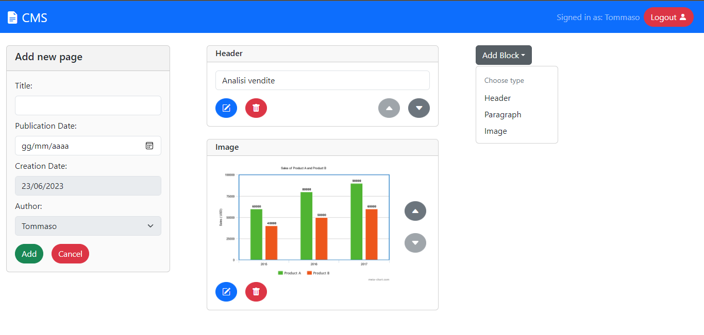
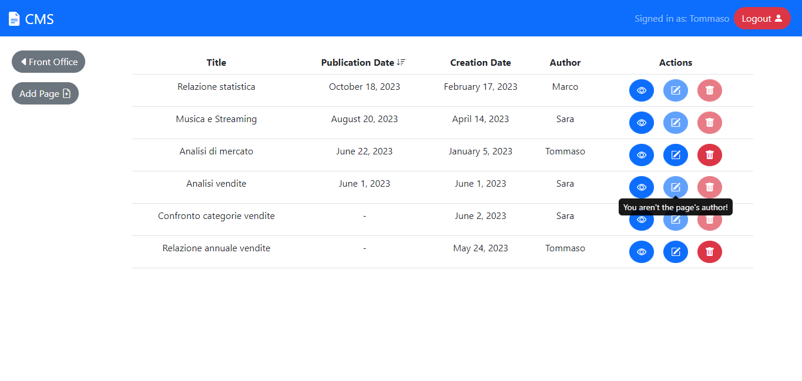

[](https://classroom.github.com/a/suhcjUE-)
# Exam #1: "CMSmall"
## Student: s318967 NATALE DAVIDE 

## React Client Application Routes

- Route `/`: pagina principale, rappresenta il front-office, mostra la lista completa di pagine pubblicate ordinate cronologicamente per data di pubblicazione, accessibile da qualsiasi utente
- Route `/view/:pageId`: pagina dedicata alla visualizzazione nel dettaglio di una pagina publicata, il cui id è rappresentato da `<pageId>`, accessibile dal front-office per utenti non autenticati
- Route `/back-office`: rappresenta il back-office, mostra la lista di tutte le pagine di qualsiasi tipo ordinate cronologicamente per data di pubblicazione, accessibile solo dagli utenti autenticati
- Route `/back-office/add`: pagina contenente il form per la creazione di una nuova pagina, accessibile solo dagli utenti autenticati 
- Route `/back-office/view/:pageId`: pagina dedicata alla visualizzazione nel dettaglio di una pagina di qualsiasi tipo, il cui id è rappresentato da `<pageId>`, accessibile dal back-office per utenti autenticati (contiene pulsanti per editare e cancellare la pagina se l'utente ne possiede i diritti)
- Route `/back-office/edit/:pageId`: pagina contente il form per la modifica di una pagina esistente, accessibile solo dagli utenti autenticati
- Route `/login`:  pagina contenente il form per l'autenticazione
- Route `/*`: default route per le route inesistenti (contiene pulsante per ritornare alla pagina principale)

## API Server

### Autenticazione

- POST `/api/sessions`
  - Descrizione: Non autenticata, crea una nuova sessione
  - Request: il body contiene un oggetto con all'interno le credenziali per l'autenticazione (Content-Type: `application/json`)
  ```
  {
      "username": "sara@test.it",
      "password": "pwd"
  }
  ```
  - Response: restituisce `200 OK` (successo), `401 Unauthorized` (credenziali errate) o `500 Internal Server Error` (errore generico). In caso di successo il body contiente un oggetto con all'interno le informazioni dell'utente autenticato (Content-Type: `application/json`) 
- DELETE `/api/sessions/current`
  - Descrizione: Autenticata, elimina la sessione corrente
  - Request: Nessun body
  - Response: restituisce `200 OK` (successo), `401 Unauthorized` (utente non autenticato) o `500 Internal Server Error` (errore generico). Nessun body
- GET `/api/sessions/current`
  - Descrizione: Autenticata, verifica che la sessione corrente è ancora valida e restituisce le informazioni dell'utente autenticato
  - Request: Nessun body
  - Response: restituisce `200 OK` (successo) o `401 Unauthorized` (utente non autenticato). In caso di successo il body contiente un oggetto con all'interno le informazioni dell'utente associato alla sessione corrente (Content-Type: `application/json`)
  ```
  {
      "id": 2,
      "username": "sara@test.it",
      "name": "Sara",
      "admin": 1
  }
  ```

### API restanti

- GET `/api/pages`
  - Descrizione: Autenticata, restituisce le informazioni (ad eccezione dei blocchi) di tutte le pagine
  - Request: Nessun body
  - Response: restituisce `200 OK` (successo), `401 Unauthorized` (utente non autenticato) o `500 Internal Server Error` (errore generico). In caso di successo il body contiente un array di oggetti rappresentati le pagine (Content-Type: `application/json`)
  ```
  [{
      "id": 1,
      "title": "Analisi Vendite",
      "publication_date": null,
      "creation_date": "2023-03-07",
      "authorId": 2,
      "author": "Sara"
  },
  ...
  ]
  ```
- GET `/api/pages/published`
  - Descrizione: Non autenticata, restituisce le informazioni (ad eccezione dei blocchi) di tutte le pagine pubblicate
  - Request: Nessun body
  - Response: restituisce `200 OK` (successo) o `500 Internal Server Error` (errore generico). In caso di successo il body contiente un array di oggetti rappresentati le pagine pubblicate (Content-Type: `application/json`)
  ```
  [{
      "id": 1,
      "title": "Analisi Vendite",
      "publication_date": "2023-04-25",
      "creation_date": "2023-03-07",
      "authorId": 2,
      "author": "Sara"
  },
  ...
  ]
  ```
- GET `/api/pages/:id`
  - Descrizione: Non autenticata, restituisce le informazioni (inclusi i blocchi) di una pagina
  - Request: Nessun body, è presente il parametro `id` che rappresenta l'id della pagina richiesta
  - Response: restituisce `200 OK` (successo), `404 Not Found` (id non valido), `401 Not Authorized` (utente non autenticato richiede una pagina non pubblicata)  o `500 Internal Server Error` (errore generico). In caso di successo il body contiente un oggetto rappresentate la pagina (Content-Type: `application/json`)
  ```
  {
      "id": 1,
      "title": "Analisi Vendite",
      "publication_date": null,
      "creation_date": "2023-03-07",
      "authorId": 2,
      "author": "Sara",
      "blocks": [...]
  }
  ```
- POST `/api/pages/`
  - Descrizione: Autenticata, crea una nuova pagina associata all'utente richiedente (l'id dell'autore è prelevato di default dalla sessione, ma se l'utente è un admin può indicare nel body un utente differente da lui)
  - Request: è presente un body contenente un oggetto al cui interno sono presenti tutte le informazioni necessari alla creazione della pagina, fatta eccezione per l'id che sarà fornito dal server (Content-Type: `application/json`)
  ```  
  {
      "title": "Analisi Vendite",
      "publication_date": null,
      "creation_date": "2023-03-07",
      "authorId": 2,
      "author": "Sara",
      "blocks": [...]
  }
  ```
  - Response: restituisce `201 Created` (successo), `422 Unprocessable Entity` (errore di validazione), `404 Not Found` (utente non esistente, nel caso l'admin indichi un utente come autore che non esiste oppure immagine inesistente nel caso si tenti di aggiungere un immagine non presente sul database), `401 Unauthorized` (utente non autenticato) o `500 Internal Server Error` (errore generico). In caso di successo il body contiente un oggetto rappresentante la pagina aggiunta, con l'id fornito dal server sia per la pagina che per i blocchi associati (Content-Type: `application/json`)
- PUT `/api/pages/:id`
  - Descrizione: Autenticata, aggiorna una pagina esistente e i relativi blocchi 
  - Request: l'id della pagina da aggiornare è rappresentato dal parametro `id`, è presente un body contenente un oggetto al cui interno sono presenti tutte le informazioni necessari per la modifica della pagina, fatta eccezione per l'id che sarà recuperato tramite l'URL (Content-Type: `application/json`)
  ```  
  {
      "title": "Analisi Vendite",
      "publication_date": null,
      "creation_date": "2023-03-07",
      "authorId": 2,
      "author": "Sara",
      "blocks": [...]
  }
  ```
  - Response: restituisce `200 Ok` (successo), `422 Unprocessable Entity` (errore di validazione), `404 Not Found` (utente non esistente, nel caso l'admin indichi un utente come autore che non esiste o id della pagina non valido oppure immagine inesistente nel caso si tenti di aggiungere un immagine non presente sul database), `401 Unauthorized` (utente non autenticato o un utente autenticato non admin tenta di cambiare l'autore della pagina) o `500 Internal Server Error` (errore generico). In caso di successo il body è rappresentato da un oggetto contenente l'informazione sul numero di modifiche effettuate nel database (Content-Type: `application/json`)
- DELETE `/api/pages/:id`
  - Descrizione: Autenticata, elimina una pagina esistente e i relativi blocchi 
  - Request: l'id della pagina da eliminare è rappresentato dal parametro `id`, non è presente un body
  - Response: restituisce `200 Ok` (successo), `422 Unprocessable Entity` (errore di validazione), `404 Not Found` (id della pagina non valido), `401 Unauthorized` (utente non autenticato o un utente autenticato non admin tenta di eliminare un pagina di cui non è autore) o `500 Internal Server Error` (errore generico). In caso di successo il body è rappresentato da un oggetto contenente l'informazione sul numero di modifiche effettuate nel database (Content-Type: `application/json`)
- GET `/api/site-name`
  - Descrizione: Non autenticata, restituisce l' informazione relativa al nome del sito
  - Request: Nessun body
  - Response: restituisce `200 OK` (successo) o `500 Internal Server Error` (errore generico). In caso di successo il body contiente un oggetto con all'interno il nome del sito (Content-Type: `application/json`)
- PUT `/api/site-name`
  - Descrizione: Autenticata, aggiorna il nome del sito
  - Request: è presente un body contenente un oggetto al cui interno è presente il nome del sito (Content-Type: `application/json`)
  - Response: restituisce `200 Ok` (successo), `422 Unprocessable Entity` (errore di validazione), `401 Unauthorized` (utente non autenticato o un utente autenticato non admin tenta di cambiare il nome del sito) o `500 Internal Server Error` (errore generico). In caso di successo il body è rappresentato da un oggetto contenente l'informazione sul numero di modifiche effettuate nel database (Content-Type: `application/json`) 
- GET `/api/images`
  - Descrizione: Autenticata, restituisce le informazioni (url) di tutte le immagine che il server mette a disposizinne nella directory public
  - Request: Nessun body
  - Response: restituisce `200 OK` (successo), `401 Unauthorized` (utente non autenticato) o `500 Internal Server Error` (errore generico). In caso di successo il body contiente un array di oggetti rappresentati le informazioni associate alle immagini (Content-Type: `application/json`)
  ```
  [{
      "id": 1,
      "url", "http://localhost:3001/images/image1.png"
  },
  ...
  ]
  ```
- GET `/api/users`
  - Descrizione: Autenticata, restituisce le informazioni di tutti gli utenti
  - Request: Nessun body
  - Response: restituisce `200 OK` (successo), `401 Unauthorized` (utente non autenticato o utente autenticato non admin tenta di accedere a tali informazioni) o `500 Internal Server Error` (errore generico). In caso di successo il body contiente un array di oggetti rappresentati le informazioni associate agli utenti (Content-Type: `application/json`)
  ```
  [{
      "id": 2,
      "name", "Sara"
  },
  ...
  ]
  ```  

## Database Tables

- Table `users` : (id, name, email, hash, salt, admin)
  - Tabella utilizzata per memorizzare le informazioni degli utenti
  - `admin` è un attributo booleano, usato per indicare se l'utente è un admin
- Table `pages` : (id, title, authorId, creation_date, publication_date)
  - Tabella utilizzata per memorizzare le informazioni principali delle pagine 
- Table `blocks` : (id, type, content, position, pageId)
  - Tabella utilizzata per memorizzare le informazioni dei blocchi associati alle pagine
  - L'attributo `type` è una stringa contenente `'h'`(header), `'p'`(paragrafo), `'img'`(immagine) che indica il tipo di blocco
  - L'attributo `content` è una stringa, utilizzata per memorizzare il contenuto testuale degli header o dei paragrafi e gli url per le immagini
- Table `images` : (id, url)
  - Tabella utilizzata per memorizzare le informazioni (url) delle immagini rese disponibili dal server pubblicamente nella directory public
- Table `site` : (id, name)
  - Tabella utilizzata per memorizzare un unica riga associata al nome del sito modificabile dagli admin


## Main React Components

- `MyNavbar` (in `Navbar.jsx`): rappresenta la Navbar che viene mostrata in ogni schermata, contiene il nome del sito e, nel caso l'utente autenticato fosse un admin, nel back-office contiene il form per la modifica del nome del sito
- `DefaultRoute` (in `DefaultRoute.jsx`): rappresenta la default route, contiene un pulsante per ritornare alla schermata principale (front-office)
- `HomeRoute` (in `HomeRoute.jsx`): componente utilizzato sia per rappresentare il front-office e il back-office, contiene un pulsante per spostarsi dal front-office al back-office e viceversa 
- `MyMain` (in `Main.jsx`): componente utilizzato per rappresentare la lista di pagine, sia nel front-office che nel back-office, con dei pulsanti in ogni riga per effettuare le operazioni che sono consentite
- `ViewRoute` (in `ViewRoute.js`): rappresenta la schermata in cui è possibile osservare nel dettaglio le informazioni su una pagina, presenta i pulsanti per editare e cancellare la pagina se l'utente è autenticato e ne possiede i diritti
- `FormRoute` (in `FormRoute.jsx`): rappresenta la scheramata che contiene il form per la creazione o la modifica di una pagina, presenta tutti i pulsanti per aggiungere, spostare, editare o eliminare i blocchi della pagina
- `LoginRoute` (in `Authentication.jsx`): rappresenta la schermata contenente il form per l'autenticazione

## Screenshot




## Users Credentials

- tommaso@test.it, pwd (autore di 2 pagine)
- sara@test.it, pwd (admin, autore di 3 pagine)
- marco@test.it, pwd (admin, autore di 1 pagina)
- emma@test.it, pwd (autore di nessuna pagina)

